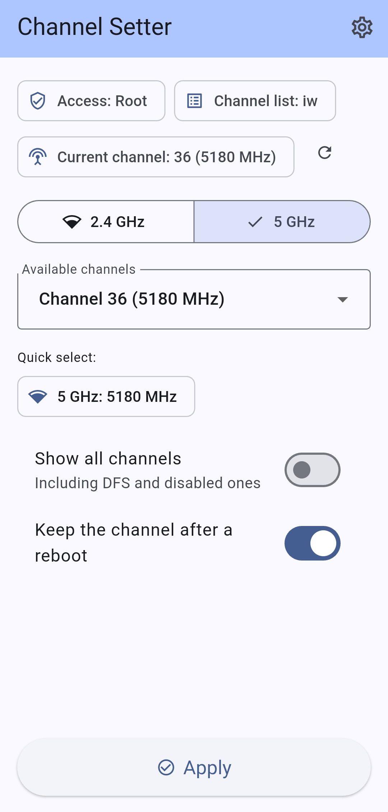
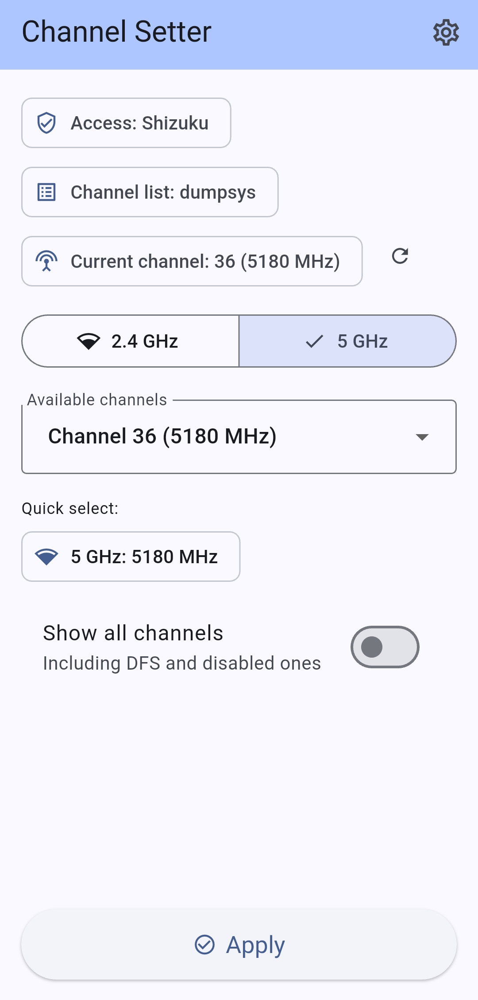

<div align="center">
  
  <h1>WiFi Channel Setter</h1>
  <p>Sets the Wi-Fi hotspot (SoftAP) channel on Android, with Shizuku or root.</p>
  <p><a href="README.md">English</a> | <a href="README.ru.md">Русский</a></p>
</div>

<p align="center">
  
  
</p>

## Features

- Lists the channels the device reports for the 2.4 GHz and 5 GHz bands, with an option to include DFS and disabled ones.
- Stores the selected channel in the hotspot configuration, so the choice survives a reboot.
- Shows the channel currently stored in the hotspot settings.
- Two access methods, Shizuku (no root) and root; the selected one is remembered.
- English and Russian.

## Requirements

- Android 11 or newer.
- Shizuku installed and running, or root.

## How it works

- **Channel list** — the app asks the device itself: `iw list`, `cmd wifi get-allowed-channel` (Android 14 and newer) or the SoftAP capability reported in `dumpsys wifi`. The source in use is shown in the app.
- **Apply** — the channel is written into the hotspot configuration, which is what the system hotspot uses:

  ```text
  getSoftApConfiguration() -> copy with the new channel -> setSoftApConfiguration()
  ```

- **Current channel** — read back with the same configuration API.

In Shizuku mode this code runs in a Shizuku user service with shell identity, in root mode in a helper process started with `app_process`.

Root mode can also apply the channel for the current session only, with the legacy command that Android 12 and newer allow to root alone:

```shell
cmd wifi force-softap-channel enabled <frequency>
```

## Install

Download the APK from the [Releases](https://github.com/Lorax121/hotspot_channel_setter/releases) page. Builds of 1.0.x are signed with a different key, so the old version has to be uninstalled before installing 1.1.0.

## Build

```shell
flutter pub get
flutter build apk --release
```

Release builds are signed with the keystore described in `android/key.properties`, which is not tracked by Git.

## Changelog

See [CHANGELOG.md](CHANGELOG.md).
